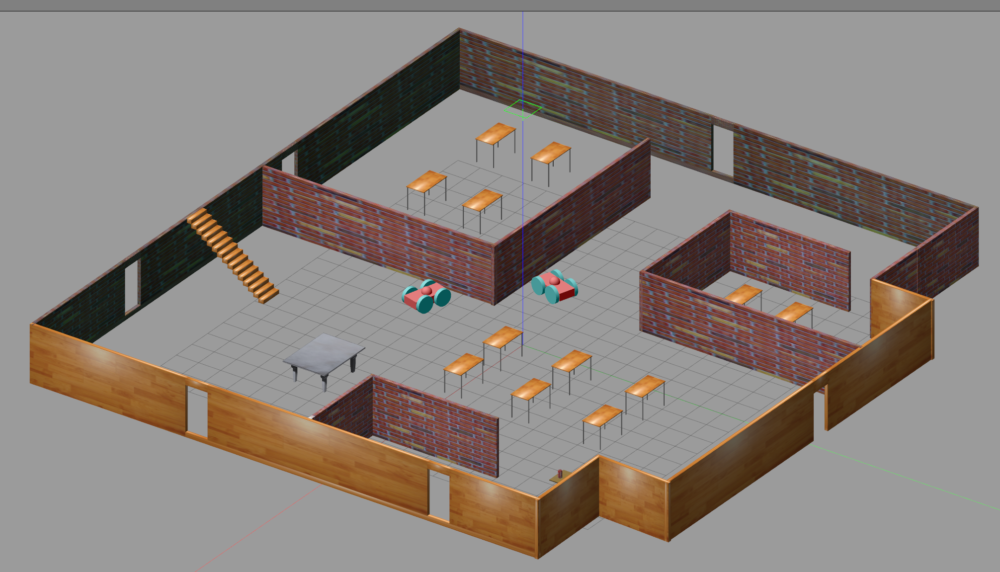

# Build My World

Built with Gazebo 9.12.0, tested with v 7.16.0 in the VM

## Instructions

1. Clone the repo and change to the `Prorject1` directory
1. Build the plugin:

    ```sh
    mkdir build && cd build
    cmake ..
    make
    ```
1. Launch the world

    ```sh
    cd ../world
    gazebo office.world
    ```

The welcome message should appear at the terminal and the world should come up.




