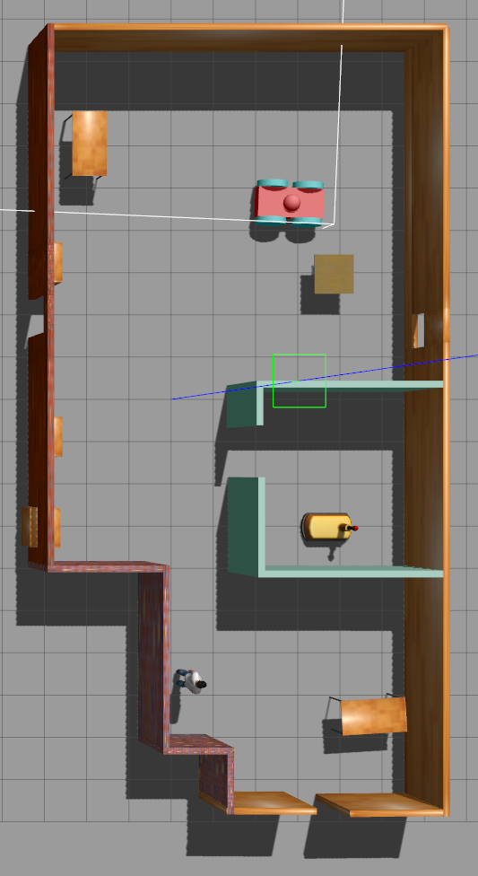
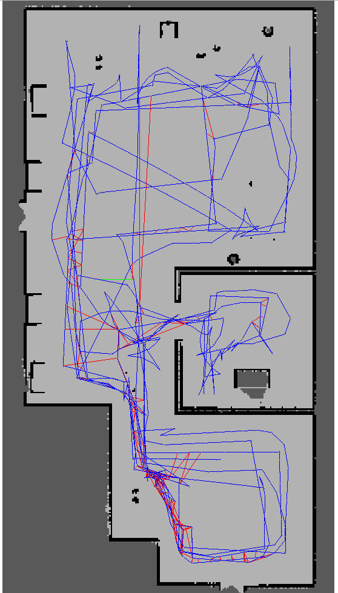
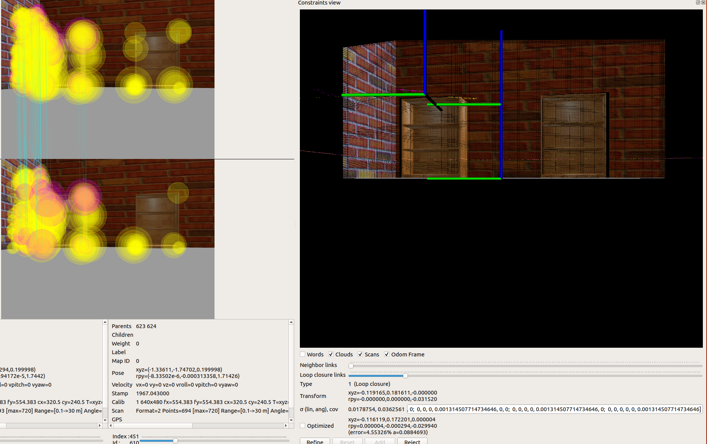

# Map my World

Driving the robot around with teleop and mapping its world.

## The world to map

Should be sufficiently feature-rich.

#### Using ORB rather than SURF features, keeping all the defaults.

## Mapping results

### RTAB-Map Database

The resulting mapping database is available [here](https://www.dropbox.com/s/fuwtrxiw456wu13/rtabmap.db?dl=0)

**NOTE** The path appears to go through the 4-wheeler robot. While driving around, the mapping robot bumped into it and moved it slightly out the original position.

Wall texture and bookcase corners provided the most useful information for the mapping.

