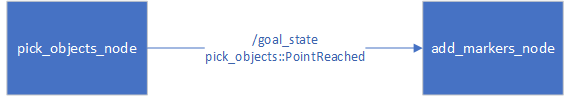

# Home Service Robot

The robot drives around a house picks up and drops off objects. We are using [TurtleBot3](http://emanual.robotis.com/docs/en/platform/turtlebot3/overview/) for this task

## Video

[](https://youtu.be/dUE83tnyloI?t=16)


## Prerequisits
1. Ubuntu 18.04
1. ROS melodic
1. Gazebo 9.12
1. GCC 7.5

## Installation

1. Install turtlebot3:

    ```sh
    sudo apt update
    sudo apt install ros-melodic-turtlebot3*
    ```
2. Set turtlebot3 model
    ```sh
    echo 'export TURTLEBOT3_MODEL=waffle_pi' >> ~/.bashrc
    ```
3. Clone this repo
    ```sh
    mkdir ~/git && cd git
    git clone https://github.com/fierval/RoboticsND.git
    ```
4. Build everything
    ```sh
    cd RoboticsND/Project7/catkin_ws
    catkin_make
    ```
5. (Optional) Add the follwoing to `~/.bashrc`
    ```sh
    PROJECT=Project7
    source /opt/ros/melodic/setup.bash
    cd ~/git/udacity/robotics/RoboticsND/$PROJECT/catkin_ws
    source devel/setup.bash
    ```
6. `source ~/.bashrc` or restart terminal

## Running

1. Start the terminal and `cd <git_root>/Project7/catkin_ws`
1. if `setup.bash` is not sourced in `.bashrc` then `source devel/setup.bash`
1. Make sure `TURTLEBOT3_MODEL` environment variable is set (above).
1. `scripts/home_service.sh`


## Architecture

Using [TurtleBot3](http://emanual.robotis.com/docs/en/platform/turtlebot3/overview/) with its navigation stack to implement SLAM and navigation. 

In order to use `TurtleBot3` with our own Gazebo world we create a package `my_turtle` which contains copies of some of the `TurtleBot3` launch files modified to launch our custom components: [home.world](catkin_ws/src/my_turtle/worlds/home.world) and [turtlebot3_navigation.rviz](catkin_ws/src/my_turtle/rviz/turtlebot3_navigation.rviz)

All of the `TurtleBot3` launch files come with RVIZ support so we do not need an extra package to store RVIZ launch and configuration files.

### SLAM and Navigation

We drive the robot around using teleop and then launch the map server to save the map to the [maps](catkin_ws/src/my_turtle/maps) folder of the [my_turtle](catkin_ws/src/my_turtle) package. This is enabled by [test_slam.sh](catkin_ws/scripts/test_slam.sh).

We then use it to test navigation with [test_navigation.sh](catkin_ws/scripts/test_navigation.sh)

### Pickup/Dropoff Simulation

We add two packages: [pick_objects](catkin_ws/src/pick_objects) (tested by [pick_objects.sh](catkin_ws/scripts/pick_objects.sh)) and [add_markers](catkin_ws/src/add_markers) (tested initially by [add_marker.sh](catkin_ws/scripts/add_marker.sh))

At this point we modify our [turtlebot3_navigation.rviz](catkin_ws/src/my_turtle/rviz/turtlebot3_navigation.rviz) to subscribe to Markers. Markers are monikers for the object that we "place" somewhere on the map for the robot to pickup, deliver to a different point in the map and drop off there.

We use moving actions for our robot to move to designated points on the map, show/hide markers there to simulate placement/pickup/dropoff.

### HomeService: Putting it all together

The [add_markers](catkin_ws/src/add_markers) package is enhanced to communicate with with [pick_objects](catkin_ws/src/pick_objects) package as shown below:



The `PointReached` message sent by `pick_objects` has the following structure:

```cpp
string name # type of reached point
float64 x
float64 y
```

where `name` can take one of the following values:

* `set` - set a goal at `(x, y)`
* `pickup` - pickup point has been reached
* `dropoff` - dropoff point has been reached

[home_service.sh](catkin_ws/scripts/home_service.sh) is launched to initiate the flow:

1. The simulation world is started
1. Navigation with AMCL is started, RVIZ launched
1. `add_markers` is started and blocks expecting communication from `pick_objects`
1. `pick_objects` is started and:
    1. Sets pickup goal by sending a `set` message to `goal_state`
    1. Navigates towards the pickup goal, once reached sends `pickup` message
    1. Waits 5 sec
    1. Repeats everything with "dropoff" instead of "pickup".

The `add_markers` node simply displays and hides markers as it receives `PointReached` messages.
