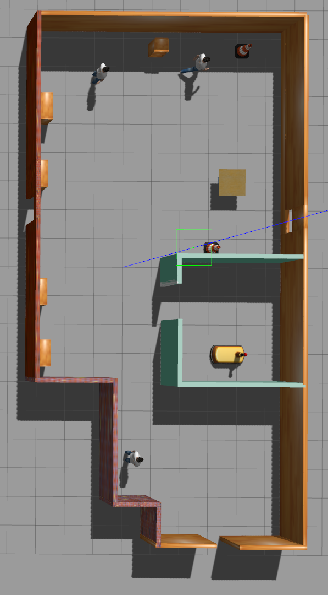
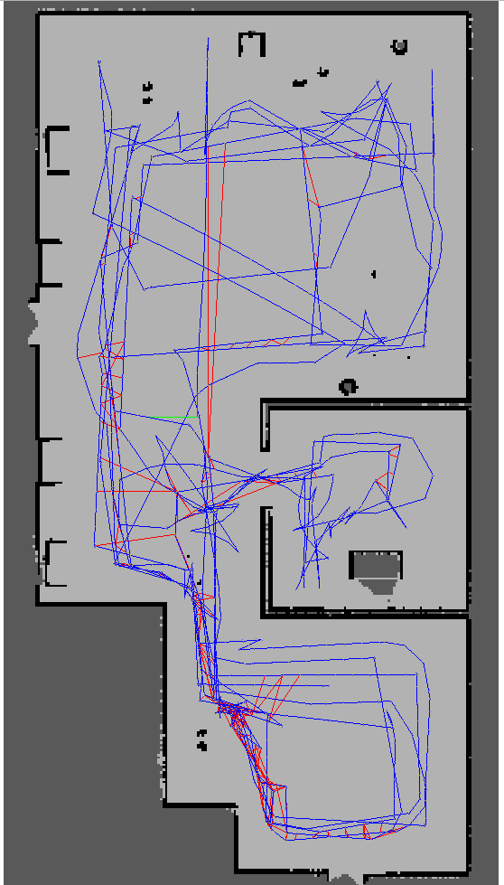
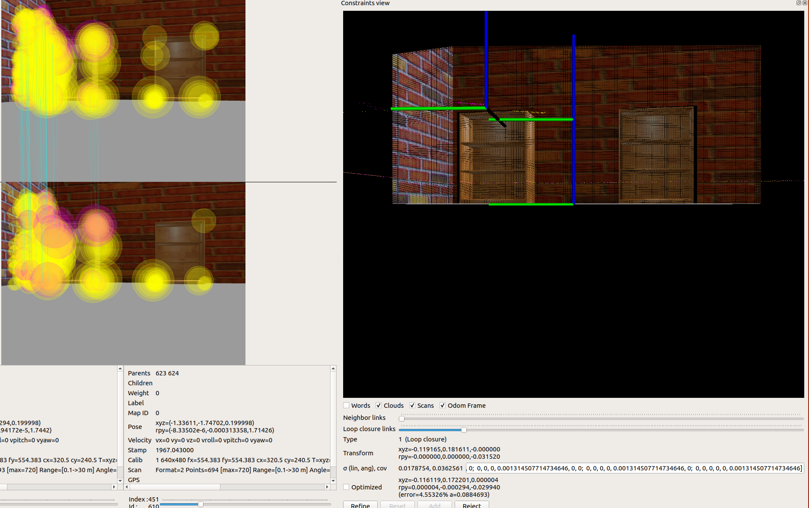

# Map my World

Driving the robot around with teleop and mapping its world.

## The world to map

Should be sufficiently feature-rich.

#### Using ORB rather than SURF features, keeping all the defaults.

## Mapping results

### RTAB-Map Database

The resulting mapping database is available [here](https://www.dropbox.com/s/ajps3ut4imy9yy1/rtabmap.db?dl=0)

Wall texture and bookcase corners provided the most useful information for the mapping.

